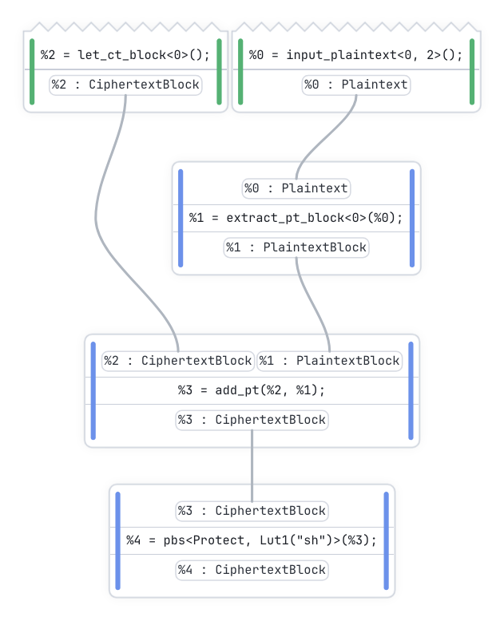
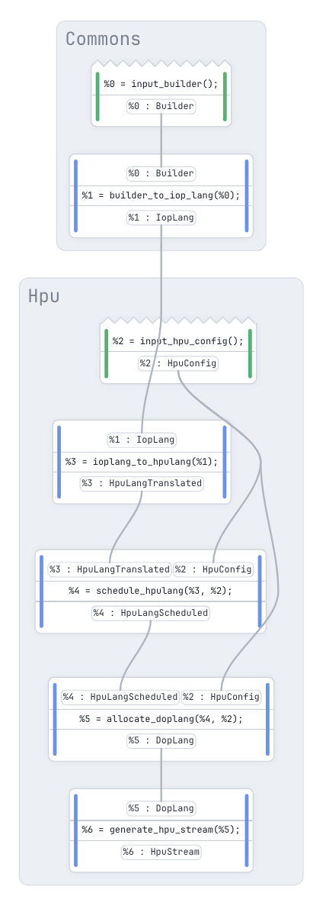
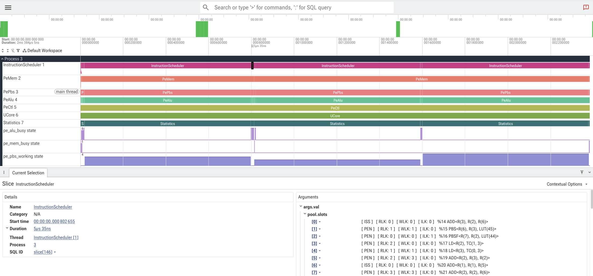

<h3 align="center">
  <pre>
╭─────╮   ┬ ╭───╮
   ╱  │   │ │    
  ╱   ╰───╮ │    
 ╱    │   │ │    
╰───╯ ┴   ╰─────╯
</pre>
</h3>
<h3 align="center">Compiler infrastructure for encrypted computation.</h3>
<p align="center">Fast from design to compilation to execution.</p>

<hr/>

<p align="center">
  <a href="https://crates.io/crates/zhc"></a>
  <a href="https://docs.rs/zhc"></a>
  <a href="https://github.com/zama-ai/zhc/blob/main/LICENSE"></a>
</p>

# What is ZHC ?

ZHC is an open-source compiler toolchain for [FHE](https://en.wikipedia.org/wiki/Homomorphic_encryption) computation: it compiles arithmetic circuits into optimized instruction streams for hardware that computes directly on encrypted data:

<div align="center">
  <pre><sub>
      ╭───────────╮                                          ╭───────────────╮
      │  Circuit  │                                     ┌───▶│      HPU      │
      │  Builder  │────┐                                │    ╰───────────────╯
      ╰───────────╯    │                                │                     
                       │           ╭─────────╮          │    ╭───────────────╮
                       ├──────────▶│   ZHC   │──────────┼───▶│  HPU Cluster  │
      ╭───────────╮    │           ╰─────────╯          │    ╰───────────────╯
      │  TFHE-rs  │    │                                │                     
      │  Graphs   │────┘                                │    ╭───────────────╮
      ╰───────────╯                                     └───▶│      CPU      │
                                                             ╰───────────────╯
</sub></pre>
</div>

Under the hood, [tfhe-rs](https://github.com/zama-ai/tfhe-rs) uses it for its [HPU](https://github.com/zama-ai/hpu_fpga) backend and experimental Circuit API. It is built atop a custom, dialect-generic SSA-IR implemented from scratch, enabling speed at every step:
+ [Design](#circuit-design): Circuit definition, visualization and evaluation on emulated semantics. A programmatic frontend, that makes sense for circuit design.
+ [Compilation](#compilation): Progressive lowering from high-level representation down to specialized hardware ISA. Target-agnostic optimizations, then hardware-aware scheduling and register allocation. All fast enough to support JIT compilation.
+ [Execution](#execution): Optimized instruction streams for HPU, HPU clusters, and CPU target. HPU and Multi-HPU streams can be evaluated against an accurate hardware simulator, delivering a streamlined development experience.

Currently ZHC focuses on the [TFHE](eprint.iacr.org/2021/1402.pdf) cryptosystem.

# Get started

To benefit from ZHC to accelerate an FHE application, just use the tfhe-rs Circuit API, and run the code in any executor.

To design new FHE algorithms, then add zhc as a dependency to any rust project and follow the [tour](#a-tour-of-zhc), or look into one of the [examples](zhc/examples) :
```shell
cargo add zhc
```

# A tour of ZHC

## Circuit Design

ZHC's main frontend is a [`Builder`](https://docs.rs/zhc_builder/latest/zhc_builder/struct.Builder.html) Rust object which can be used to programmatically build arithmetic circuits. It can be used to define circuits and access some design-oriented features:



```rust
use zhc::prelude::*;

// 2 carry bits / 2 message bits
let bd = Builder::new(CiphertextBlockSpec(2, 2));
let pti =  bd.plaintext_input(2);
let pt =   bd.plaintext_split(pti)[0];
let ct =   bd.block_let_ciphertext(0);
let trv =  bd.block_add_plaintext(ct, pt);
let sh =   bd.block_lookup(
                trv,
                Lut1Def::custom(
                    "sh", 
                    |e| e.protect_shr(1)
                )
           );

bd.draw().open();
```

<br clear="right">

The [`draw`](https://docs.rs/zhc_builder/latest/zhc_builder/struct.Builder.html#method.draw) method renders the underlying intermediate representation to an interactive graph suitable to visual inspection. This graph can optionally be annotated with various informations such as emulation values, scheduling slack, noise level, etc.

The API exposed by the `Builder` object, offers a semantic tailored to the TFHE cryptosystem. Operations are available in [different flavors](https://docs.rs/zhc_crypto/latest/zhc_crypto/integer_semantics/index.html) depending on how they treat the __padding bit__. To simplify the debugging without having to go through encryptions/decryptions cycles, the builder object exposes an emulation layer which performs an abstract interpretation of the program and annotates the intermediate values: 

```rust
bd.interpret()
    .with_inputs([pti.make_value(3)])
    .dump();
// On stdout:
// ╔═══════════════════════════════════
// ║ Interpretation for : [3_pt]
// ║───────────────────────────────────
// ║ %0 = input_plaintext<0, 2>();
// ║     %0 -> 11_pt
// ║ %1 = extract_pt_block<0>(%0);
// ║     %1 -> 11_ptblock
// ║ %2 = let_ct_block<0>();
// ║     %2 -> 0_00_00_ctblock
// ║ %3 = add_pt(%2, %1);
// ║     %3 -> 0_00_11_ctblock
// ║ %4 = pbs<Protect, Lut1("sh")>(%3);
// ║     %4 -> 0_00_01_ctblock
// ╚═══════════════════════════════════
```

The invariants of the semantics are checked during this abstract interpretation. Combined with [`Builder::test_random`](https://docs.rs/zhc_builder/latest/zhc_builder/struct.Builder.html#method.test_random), which runs the circuit on random inputs against a plaintext oracle, the users can check their implementation at the algorithm level.

Noise management is a big part of implementing FHE algorithms; it must always stay within some bounds to ensure the data are not corrupted. The [`Builder::dump_noise_budget`](https://docs.rs/zhc_builder/latest/zhc_builder/struct.Builder.html#method.dump_noise_budget) method performs a noise analysis and displays it in a suitable format:
```rust
bd.dump_noise_budget()
// On stdout:
// ╔════════════════════════════════════════════
// ║ Noise Analysis
// ║────────────────────────────────────────────
// ║ @0   |  %0 = input_plaintext<0, 2>();
// ║      |      %0 -> ░░░░░░░░░░░░   0%
// ║ @1   |  %1 = extract_pt_block<0>(%0);
// ║      |      %1 -> ░░░░░░░░░░░░   0%
// ║ @2   |  %2 = let_ct_block<0>();
// ║      |      %2 -> ░░░░░░░░░░░░   0%
// ║ @3   |  %3 = add_pt(%2, %1);
// ║      |      %3 -> ░░░░░░░░░░░░   0%
// ║ @4   |  %4 = pbs<Protect, Lut1("sh")>(%3);
// ║      |      %4 -> ▓░░░░░░░░░░░   8% (fresh)
// ╚════════════════════════════════════════════
```

Note that ZHC also checks the noise during compilation to ensure that no noise-broken circuits can reach the end of the pipeline.

## Compilation



The compiler itself is managed via the [`Pipeline`](https://docs.rs/zhc_pipeline/latest/zhc_pipeline/struct.Pipeline.html) object, providing a lazy, query-based compilation of all artifacts. Itself based on a [ZHC-IR definition](https://docs.rs/zhc_langs/latest/zhc_langs/pipelinelang/index.html), it ensures a single source of truth for every artifact derivation. The pipeline, restricted to the HPU is represented on the left. Compilation from the block-level IR down to the HPU ISA occurs via a progressive lowering spanning several different dialects.
```rust
let mut pl = Pipeline::new()
    .with_builder(bd)
    .with_hpu_config(Default::default());
pl.get_hpu_assembly().open().unwrap();
pl.get_hpu_trace().open().unwrap();
```

Artifacts are pulled from the pipeline with `get_*` methods. Every intermediate artifacts are cached in the pipeline, and can be pulled for inspection.

The HPU pipeline takes roughly three steps. First, target-agnostic optimizations are applied to the [`IopLang`](https://docs.rs/zhc_langs/latest/zhc_langs/ioplang/index.html) IR. This representation is then lowered to the [`HpuLang`](https://docs.rs/zhc_langs/latest/zhc_langs/hpulang/index.html) dialect, on which scheduling and PBS batching is performed. Once scheduled, a linear scan register allocator translates the code to [`DopLang`](https://docs.rs/zhc_langs/latest/zhc_langs/doplang/index.html) dialect, which corresponds to the HPU ISA. 

<br clear="left">

<details>
<summary>About Scheduling</summary>
<br>
    
FHE is special for its large imbalance in operation latency: ratio between PBS to linear operations (the two broad categories), can be from 100s to 1000s. This makes textbook scheduler approaches unsuitable in this regime. Our scheduler mixes as-late-as-possible list-scheduling with a lightweight simulation, to both schedule and batch PBS operations together in one pass. 

</details>

<details>
<summary>About Verification</summary>
<br>
    
Every passes of the pipeline (including scheduling and register allocation) is verified, on [_the complete IOP library_](https://docs.rs/zhc/latest/zhc/prelude/compat/enum.Iop.html), for precisions ranging from 2 to 128bits. The current approach used for verification is differential evaluation. For each circuit, the IRs before and after the pass are both emulated (each dialect having its own emulator) on a large number of inputs, and the results are asserted bitwise equals.

</details>

<details>
<summary>About Compilation time</summary>
<br>
    
Compilation time is on the order of a few microseconds per instruction (well below the time the HPU takes to execute them) so compilation can be pipelined with execution, staying off the critical path. This makes Just-In-Time compilation of FHE programs possible: operation graphs produced at runtime (e.g. via the tfhe-rs Circuit API) are compiled as whole programs, and the scheduling and batching gains largely repay the compile time.

</details>

## Execution

ZHC is currently capable of targetting HPU, HPU-Clusters, and an experimental CPU Virtual Machine.



Not every circuit designer has an HPU board handy. To simplify the development of HPU programs, ZHC includes a simulator for the HPU and HPU-Cluster targets, which can be used to get an accurate estimation of the HPU behavior on the compiled streams. Even better, [Perfetto](https://perfetto.dev/) traces of the execution, can be extracted from the simulator using the [`Pipeline::get_hpu_trace`](https://docs.rs/zhc_pipeline/latest/zhc_pipeline/struct.Pipeline.html#method.get_hpu_trace). For faster feedback loops, simpler aggregate metrics can be accessed with [`Pipeline::get_hpu_metrics`](https://docs.rs/zhc_pipeline/latest/zhc_pipeline/struct.Pipeline.html#method.get_hpu_metrics).

<br clear="left">
