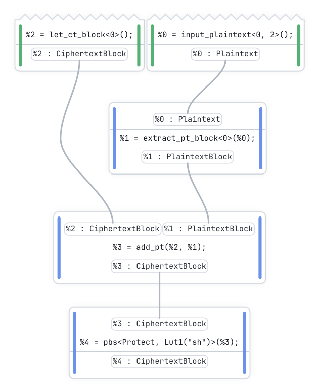
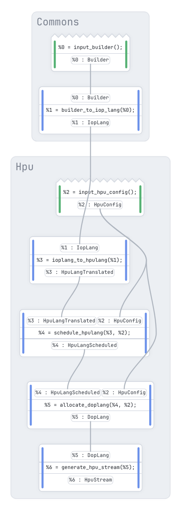
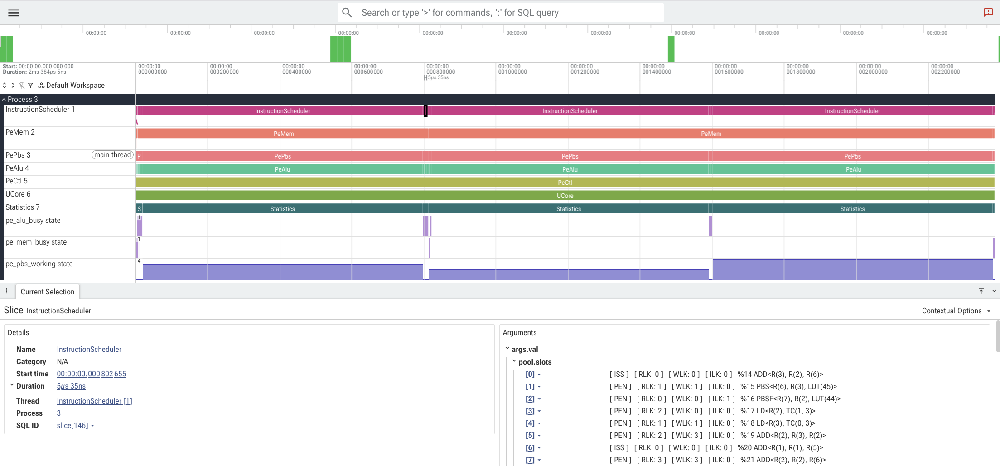

<h3 align="center">
  <pre>
╭─────╮   ┬ ╭───╮
   ╱  │   │ │    
  ╱   ╰───╮ │    
 ╱    │   │ │    
╰───╯ ┴   ╰─────╯
</pre>
</h3>
<h3 align="center">Compiler infrastructure for encrypted computation.</h3>

<hr/>

<p align="center">
  <a href="https://crates.io/crates/zhc"></a>
  <a href="https://docs.rs/zhc"></a>
  <a href="https://github.com/zama-ai/zhc/blob/main/LICENSE"></a>
</p>

# What is ZHC?

ZHC is an open-source compiler toolchain for [FHE](https://en.wikipedia.org/wiki/Homomorphic_encryption) computation: it compiles integer arithmetic circuits into optimized instruction streams for hardware that computes directly on encrypted data. From arithmetic to silicon, ZHC optimizes FHE programs above the cryptography and ensures peak performance is reached on every target. The IopLang Intermediate Representation makes plugging in new frontends and backends easy:

<div align="center">
  <pre><sub>
      ╭───────────╮                                          ╭───────────────╮
      │   Rust    │                                     ┌───▶│      HPU      │
      │  Builder  │────┐                                │    ╰───────────────╯
      ╰───────────╯    │                                │                     
                       │           ╭─────────╮          │    ╭───────────────╮
                       ├──────────▶│ IopLang │──────────┼───▶│  HPU Cluster  │
      ╭───────────╮    │           ╰─────────╯          │    ╰───────────────╯
      │  TFHE-rs  │    │                                │                     
      │  Circuit  │────┘                                │    ╭───────────────╮
      ╰───────────╯                                     └───▶│      CPU      │
                                                             ╰───────────────╯
</sub></pre>
</div>

Today, [tfhe-rs](https://github.com/zama-ai/tfhe-rs) uses it for its [HPU](https://github.com/zama-ai/hpu_fpga) backend and experimental Circuit-API. ZHC is built atop a custom, dialect-generic SSA-IR implemented from scratch, enabling speed at every step:
+ [Design](#circuit-design): Circuit definition, visualization and evaluation on emulated semantics. A programmatic frontend that makes sense for circuit design.
+ [Compilation](#compilation): Progressive lowering from high-level representation down to specialized hardware ISA. Target-agnostic optimizations, then hardware-aware scheduling and register allocation. All fast enough to support JIT scenarios.
+ [Execution](#execution): Optimized instruction streams for HPU, HPU clusters, and CPU targets. HPU and Multi-HPU streams can be evaluated against an accurate hardware simulator, delivering a streamlined development experience.

ZHC focuses on the [TFHE](https://eprint.iacr.org/2021/1402.pdf) cryptosystem.

# Get started

To design a new FHE algorithm, add ZHC to a Rust project and follow the [tour](#a-tour-of-zhc), or look at the [examples](zhc/examples):

```shell
cargo add zhc
```

To work on the compiler itself, clone the repository and make sure you have Rust 2024 edition:

```shell
git clone https://github.com/zama-ai/zhc
cd zhc
make test          # cargo test --release
make check         # warnings as errors, docs build
make big-test      # ignored tests: differential checks on every operation
make bench         # predicted latency for every operation and bit width
```

The CPU target depends on tfhe-rs and is built and tested separately:

```shell
make vm-test
```

To get up to speed quickly, start looking into :
+ [`Pipeline`](https://docs.rs/zhc_pipeline/latest/zhc_pipeline/struct.Pipeline.html) first,
+ then [`Builder`](https://docs.rs/zhc_builder/latest/zhc_builder/struct.Builder.html), 
+ then [`IR`](https://docs.rs/zhc_ir/latest/zhc_ir/struct.IR.html). 

If more context is needed, a module-level documentation describing its design is included with every crate.

# A tour of ZHC

## Circuit Design

ZHC's main frontend is the Rust [`Builder`](https://docs.rs/zhc_builder/latest/zhc_builder/struct.Builder.html) object which can be used to programmatically build arithmetic circuits. It provides access to design-oriented features:



```rust
use zhc::prelude::*;

// 2 carry bits / 2 message bits
let bd = Builder::new(CiphertextBlockSpec(2, 2));
let pti =  bd.plaintext_input(2);
let pt =   bd.plaintext_split(pti)[0];
let ct =   bd.block_let_ciphertext(0);
let trv =  bd.block_add_plaintext(ct, pt);
let sh =   bd.block_lookup(
                trv,
                Lut1Def::custom(
                    "sh", 
                    |e| e.protect_shr(1)
                )
           );

bd.draw().open();
```

<br clear="right">

The [`draw`](https://docs.rs/zhc_builder/latest/zhc_builder/struct.Builder.html#method.draw) method renders the underlying intermediate representation to an interactive graph suitable for visual inspection. This graph can optionally be annotated with various information such as emulation values, noise level, etc.

The API exposed by the `Builder` object offers a semantic tailored to the TFHE cryptosystem. Operations are available in [different flavors](https://docs.rs/zhc_crypto/latest/zhc_crypto/integer_semantics/index.html) depending on how they treat the __padding bit__. To simplify the debugging without having to go through encryption/decryption cycles, the builder object exposes an emulation layer which performs an abstract interpretation of the program and annotates the intermediate values: 

```rust
bd.interpret()
    .with_inputs([pti.make_value(3)])
    .dump();
// On stdout:
// ╔═══════════════════════════════════
// ║ Interpretation for : [3_pt]
// ║───────────────────────────────────
// ║ %0 = input_plaintext<0, 2>();
// ║     %0 -> 11_pt
// ║ %1 = extract_pt_block<0>(%0);
// ║     %1 -> 11_ptblock
// ║ %2 = let_ct_block<0>();
// ║     %2 -> 0_00_00_ctblock
// ║ %3 = add_pt(%2, %1);
// ║     %3 -> 0_00_11_ctblock
// ║ %4 = pbs<Protect, Lut1("sh")>(%3);
// ║     %4 -> 0_00_01_ctblock
// ╚═══════════════════════════════════
```

The invariants of the semantics are checked during this abstract interpretation. Combined with [`Builder::test_random`](https://docs.rs/zhc_builder/latest/zhc_builder/struct.Builder.html#method.test_random), which runs the circuit on random inputs against a plaintext oracle, the users can check their implementation at the algorithm level.

Noise management is a big part of implementing FHE algorithms; it must always stay within some bounds to ensure the data are not corrupted. The [`Builder::dump_noise_budget`](https://docs.rs/zhc_builder/latest/zhc_builder/struct.Builder.html#method.dump_noise_budget) method performs a noise analysis and displays it in a suitable format:
```rust
bd.dump_noise_budget();
// On stdout:
// ╔════════════════════════════════════════════
// ║ Noise Analysis
// ║────────────────────────────────────────────
// ║ @0   |  %0 = input_plaintext<0, 2>();
// ║      |      %0 -> ░░░░░░░░░░░░   0%
// ║ @1   |  %1 = extract_pt_block<0>(%0);
// ║      |      %1 -> ░░░░░░░░░░░░   0%
// ║ @2   |  %2 = let_ct_block<0>();
// ║      |      %2 -> ░░░░░░░░░░░░   0%
// ║ @3   |  %3 = add_pt(%2, %1);
// ║      |      %3 -> ░░░░░░░░░░░░   0%
// ║ @4   |  %4 = pbs<Protect, Lut1("sh")>(%3);
// ║      |      %4 -> ▓░░░░░░░░░░░   8% (fresh)
// ╚════════════════════════════════════════════
```

Note that ZHC also checks the noise during compilation to ensure that no noise-incorrect circuits can reach the end of the pipeline.

## Compilation



The compiler itself is managed via the [`Pipeline`](https://docs.rs/zhc_pipeline/latest/zhc_pipeline/struct.Pipeline.html) object, providing a lazy, query-based compilation of all artifacts. Itself based on a [ZHC-IR definition](https://docs.rs/zhc_langs/latest/zhc_langs/pipelinelang/index.html), it ensures a single source of truth for every artifact derivation. The pipeline, restricted to the HPU is represented on the left. Compilation from the block-level IR down to the HPU ISA occurs via a progressive lowering spanning several different dialects.
```rust
let mut pl = Pipeline::new()
    .with_builder(bd)
    .with_hpu_config(Default::default());
pl.get_hpu_assembly().open().unwrap();
pl.get_hpu_trace().open().unwrap();
```

Artifacts are pulled from the pipeline with `get_*` methods. Every intermediate artifact is cached in the pipeline, and can be pulled for inspection.

The single HPU pipeline takes roughly three steps. First, target-agnostic optimizations are applied to the [`IopLang`](https://docs.rs/zhc_langs/latest/zhc_langs/ioplang/index.html) IR. This representation is then lowered to the [`HpuLang`](https://docs.rs/zhc_langs/latest/zhc_langs/hpulang/index.html) dialect, on which scheduling and PBS batching is performed. Once scheduled, a linear scan register allocator translates the code to [`DopLang`](https://docs.rs/zhc_langs/latest/zhc_langs/doplang/index.html) dialect, which corresponds to the HPU ISA. 

<br clear="left">

<details>
<summary>About Scheduling</summary>
<br>
    
FHE is special for its large imbalance in operation latency: the ratio of PBS to linear operations runtimes (the two broad categories) can be from 100s to 1000s. This makes textbook scheduler approaches unsuitable in this regime. Our scheduler mixes as-late-as-possible list-scheduling with a lightweight simulation, to both schedule and batch PBS operations together in one pass. 

</details>

<details>
<summary>About Verification</summary>
<br>
    
Every pass of the pipeline (including scheduling and register allocation) is verified, on [_the complete IOP library_](https://docs.rs/zhc/latest/zhc/prelude/compat/enum.Iop.html), for precisions ranging from 2 to 128 bits. The current approach used for verification is differential evaluation. For each circuit, the IRs before and after the pass are both emulated (each dialect having its own emulator) on a large number of inputs, and the results are asserted bitwise equal.

</details>

<details>
<summary>About Compilation time</summary>
<br>
    
Compilation time is on the order of a few microseconds per instruction (well below the time the HPU takes to execute them) so compilation can be pipelined with execution, staying off the critical path. This makes Just-In-Time compilation of FHE programs scenarios possible: operation graphs produced at runtime can be compiled as whole programs on-the-fly, and the scheduling and batching gains largely repay the compile time.

</details>

## Execution

ZHC currently targets the HPU, HPU clusters, and, experimentally, the CPU.

### HPU

For the HPU targets, the end product is a stream of 32-bit instruction words, loaded on the board by `tfhe-rs`. The same program can be obtained as a text assembly listing via [`Pipeline::get_hpu_assembly`](https://docs.rs/zhc_pipeline/latest/zhc_pipeline/struct.Pipeline.html#method.get_hpu_assembly). The preamble contains the signature of the circuit and the lookup tables registry. Here is the beginning of a 16-bit addition:

```text
; !preamble {
; [signature]
; (Ciphertext<16, 2, 2>, Ciphertext<16, 2, 2>) -> Ciphertext<16, 2, 2>
; [lut]
; ManyCarryMsg: [0, 1, 2, 3, 0, 1, 2, 3, 0, 0, 0, 0, 1, 1, 1, 1]
; ExtractPropGroup0: [0, 0, 0, 1, 2, 2, 2, 2, 0, 0, 0, 1, 2, 2, 2, 2]
; ...
; }
LD R0 TS[1].3
LD R1 TS[0].3
LD R2 TS[1].2
LD R3 TS[0].2
ADD R0 R1 R0
LD R1 TS[1].0
LD R4 TS[0].0
ADD R2 R3 R2
...
PBS R4 R3 PbsExtractPropGroup0
PBS_ML2 R6 R1 PbsManyCarryMsg
PBS R5 R2 PbsExtractPropGroup1
```



Not every circuit designer has an HPU board/cluster handy. To simplify the development of performant programs, ZHC includes a simulator for the HPU and HPU-Cluster targets, which can be used to get an accurate estimation of the HPU behavior on the compiled streams. Even better, [Perfetto](https://perfetto.dev/) traces of the execution can be extracted from the simulator using the [`Pipeline::get_hpu_trace`](https://docs.rs/zhc_pipeline/latest/zhc_pipeline/struct.Pipeline.html#method.get_hpu_trace) method. 

<br clear="right">

For faster feedback loops, simpler aggregate metrics can be accessed with [`Pipeline::get_hpu_metrics`](https://docs.rs/zhc_pipeline/latest/zhc_pipeline/struct.Pipeline.html#method.get_hpu_metrics). They simulator latency is decomposed into several components: the time an ideal schedule would spend bootstrapping, the time lost to under-filled batches, and the time the pbs execution unit spends waiting:

```rust
pl.get_hpu_metrics().dump();
// On stdout:
// ╔══════════════════════════════════════════════════════════════════
// ║ HPU Metrics
// ║──────────────────────────────────────────────────────────────────
// ║   Latency          : 3224.84 µs
// ║     PBS ideal      : 1554.46 µs  (lower bound)
// ║     Batch overhead : 1554.46 µs  (under-filled batches)
// ║     Starvation     : 115.92 µs  (PE waiting for work)
// ║   Slot occupancy   : 43.8%
// ║   Timeout launches : 0 / 4 batches
// ║──────────────────────────────────────────────────────────────────
// ║   Batch Size Histogram:
// ║     4 │░░░░░░░░░░░░░░░░░░░░░░░░░░░░░░░░░░░░░░░░░░░░░░░░░░░░░░░░▒▓● (2)
// ║     5 │░░░░░░░░░░░░░░░░░░░░░░░░░░░▒▓● (1)
// ║     8 │░░░░░░░░░░░░░░░░░░░░░░░░░░░▒▓● (1)
// ╚══════════════════════════════════════════════════════════════════
```

<details>
<summary>About simulation</summary>
<br>

The simulator is a discrete-event model of the HPU at the cycle level. It models the frontend micro-core, the hardware instruction scheduler and the different processing elements of a board.  Latencies are derived from physical parameters of the design ([`HpuConfig`](https://docs.rs/zhc_config/latest/zhc_config/hpu/struct.HpuConfig.html)). 

</details>

### HPU cluster

HPUs can be interconnected into a cluster, allowing fast transfers of ciphertexts within the pool. This allows large computations to be spread over more processing elements, lowering the execution latency. Thanks to an automatic partitioning mechanism, ZHC is able to balance the workload over the boards without any interventions.

Same as for a single board, the whole system can be simulated together, so [`Pipeline::get_multi_hpu_trace`](https://docs.rs/zhc_pipeline/latest/zhc_pipeline/struct.Pipeline.html#method.get_multi_hpu_trace) shows every board and every transfer on a single perfetto timeline.

```rust
let mut pl = Pipeline::new()
    .with_builder(bd)
    .with_multi_hpu_config(MultiHpuConfig { n_hpus: 4, ..Default::default() });
let streams = pl.get_multi_hpu_stream();   // one stream per board
pl.get_multi_hpu_trace().open().unwrap();
```

<details>
<summary>Automatic circuit partitioning</summary>
<br>

To balance computation inside an HPU cluster, ZHC relies on a task-level parallelism framework. The [`IopLang`] circuit is turned to a [`TaskLang`] circuit representing the network of PBSes of the circuit. This dag of tasks is then mapped on the cluster accounting for both the dependencies, the locality of the data and the prefered concentration of work. This mapping is further materialized back into a new [`IopLang`] IR with explicit transfers, and potentially replication of work if better.

</details>

### CPU

CPU can be targetted by ZHC via the `zhc_vm` crate, which contains a topology-aware multi-threaded Virtual Machine for a custom FHE bytecode. Requiring no other dependencies than `tfhe-rs` for the cryptographic operators, `zhc_vm` is a small, self-contained runtime built for maximum performance.

ZHC leverages the same generic task parallelism framework used to accelerate HPU-clusters, to derive an [`ExecutionPlan`] from the same input algorithm. This plan contains a static schedule of the bytecode to be executed by every threads of the machine, and a lock table ensuring the safety of the execution. This unlocks performances not achievable by dynamic work-stealing schedulers commonly used. 

```rust
let plan = Pipeline::new()
    .with_builder(bd)
    .with_vm_config(config)
    .into_vm_execution_plan();

let mut vm = Vm::new(&config, None);
vm.set_server_key(server_key);
vm.execute(&plan, &inputs, &mut outputs);
```
